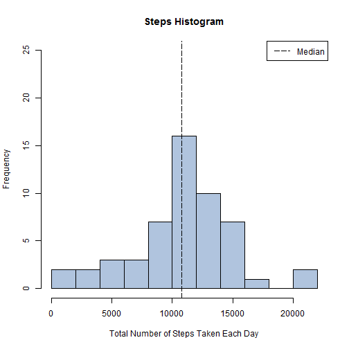
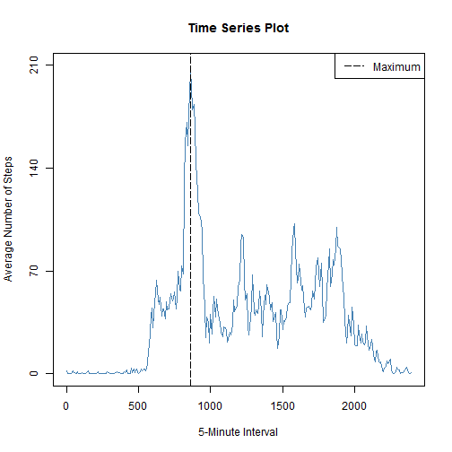
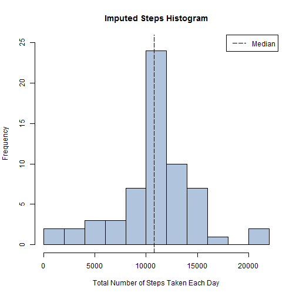
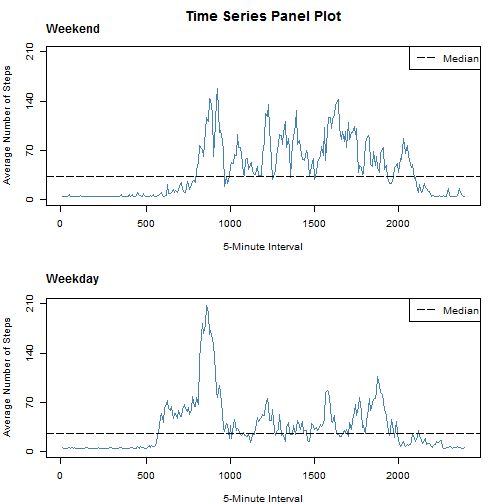

***


**Introduction**

For this assessment we will use data from a personal activity monitoring device; more information can be found in the [README file](https://github.com/MVB1/RepData_PeerAssessment1/blob/master/README.md). In brief, we will load and preprocess data (**step 1**), calculate the mean total number of steps taken per day (**step 2**), determine the average daily activity pattern (**step 3**), impute missing values (**step 4**), and determine whether there are any differences in activity patterns between weekdays and weekends (**step 5**). 

NOTE: this file has been created with RStudio Version 0.98.1087 (operating system: Windows 7 Professional). 


***


1. **Loading and preprocessing data**
***Start assessment***
  

```r
DateStarted <- date()
DateStarted
```

```
## [1] "Sun Jan 18 19:12:23 2015"
```

***Load required packages***
  

```r
library(reshape2)
```

***Read file***
  

```r
Activity <- read.csv(file="./activity.csv", na.strings="NA")
    str(Activity)
```

```
## 'data.frame':	17568 obs. of  3 variables:
##  $ steps   : int  NA NA NA NA NA NA NA NA NA NA ...
##  $ date    : Factor w/ 61 levels "2012-10-01","2012-10-02",..: 1 1 1 1 1 1 1 1 1 1 ...
##  $ interval: int  0 5 10 15 20 25 30 35 40 45 ...
```

***Melt data***
  

```r
Activity$interval <- as.factor(Activity$interval)
Melted <- melt(Activity, id=c("date", "interval"))
```

***Process data to allow calculation of total number of steps per day***
  

```r
MeltedDay <- Melted[order(Melted$date),]
Day <- dcast(MeltedDay, date~variable, sum)
Day <- Day[, 1:2]
    length(Day$steps[Day$steps == "NA"])
```

```
## [1] 8
```
There are 8 days with missing values.

***Process data to allow assessment of average number of steps per 5-minute interval***
  

```r
MeltedInterval <- Melted[order(Melted$interval),]
Interval <- dcast(MeltedInterval, interval~variable, mean, na.rm=TRUE)
Interval <- Interval[, 1:2]
    length(Interval$steps[Interval$steps == "NA"])
```

```
## [1] 0
```
There are no missing values (missing values have been removed).


***


2. **What is the mean total number of steps taken per day?**
***Generate histogram of the total number of steps taken each day***
  

```r
hist(Day$steps, xlab="Total Number of Steps Taken Each Day", ylab="Frequency", ylim=c(0, 25), yaxp=c(0, 25, n=5), main="Steps Histogram", col="lightsteelblue", breaks=10)
    abline(v=median(Day$steps, na.rm=TRUE), lty="longdash", lwd=1)
    legend("topright", legend="Median", lwd=1, lty="longdash", col="black")
```

 

This histogram is generated using the base plotting system. Please note that the y-axis has been adjusted to ease comparisons (between **step 2** and **step 4**).

***Calculate the mean and median total number of steps taken per day***
  

```r
MeanDay <- mean(Day$steps, na.rm=TRUE)
    round(MeanDay, 2)
```

```
## [1] 10766.19
```

```r
    round(MeanDay, 0)
```

```
## [1] 10766
```

```r
MedianDay <- median(Day$steps, na.rm=TRUE)
    MedianDay
```

```
## [1] 10765
```
The mean and median total number of steps taken per day are 10766 (rounded) and 10765, respectively (missing values are ignored).

3. **What is the average daily activity pattern?**
***Time series plot of 5-minute interval and average number of steps taken***  
  

```r
plot(Interval$steps, type="l", xlab="5-Minute Interval", ylab="Average Number of Steps", ylim=c(0, 210), yaxp=c(0, 210, n=3), main="Time Series Plot", col="steelblue", xaxt="n")
    axis(1, at=c(1, 61, 121, 181, 241), labels=c(0, 500, 1000, 1500, 2000))
    abline(v=104, lty="longdash", lwd=1, col="black")
    legend("topright", legend="Maximum", lwd=1, lty="longdash", col="black")
```

 

This time series plot is generated using the base plotting system.

***Calculate maximum number of steps***
  

```r
Row <- which.max(Interval$steps)
IntervalSub <- Interval[Row, 1]
IntervalSub <- as.numeric(levels(droplevels(IntervalSub)))
    IntervalSub
```

```
## [1] 835
```
Interval 835 contains the maximum number of steps (see dotted line in the time series plot).


***


4. **Imputing missing values**
***Determine total number of missing values in data set***
  

```r
NotComplete <- Activity[!complete.cases(Activity),]
    nrow(NotComplete)
```

```
## [1] 2304
```
The total number of rows that contain missing values is 2304.
  
***Fill in all missing values in data set***
  

```r
Imputed <- Activity
Imputed$steps[is.na(Imputed$steps)] <- (MedianDay/288)
```
The strategy chosen for filling all of the missing values is not sophisticated: the median number of steps divided by the number of interval levels.

***Create new data set equal to original data set but with missing data filled in***
    
*Melt data*
    

```r
ImputedMelted <- melt(Imputed, id=c("date", "interval"))
```
    
*Process data to allow calculation of total number of steps per day*
    

```r
ImputedMeltedDay <- ImputedMelted[order(ImputedMelted$date),]
ImputedDay <- dcast(ImputedMeltedDay, date~variable, sum)
ImputedDay <- ImputedDay[, 1:2]
      length(ImputedDay$steps[ImputedDay$steps == "NA"])
```

```
## [1] 0
```
There are no missing values.
    
*Process data to allow assessment of average number of steps per 5-minute interval*
    

```r
ImputedMeltedInterval <- ImputedMelted[order(ImputedMelted$interval),]
ImputedInterval <- dcast(ImputedMeltedInterval, interval~variable, mean, na.rm=TRUE)
ImputedInterval <- ImputedInterval[, 1:2]
      length(ImputedInterval$steps[ImputedInterval$steps == "NA"])
```

```
## [1] 0
```
There are no missing values.
    
***Mean total number of steps taken per day for imputed data***
    
*Generate histogram of the total number of steps taken each day*
    

```r
hist(ImputedDay$steps, xlab="Total Number of Steps Taken Each Day", ylab="Frequency", ylim=c(0, 25), yaxp=c(0, 25, n=5), main="Imputed Steps Histogram", col="lightsteelblue", breaks=10)
      abline(v=median(ImputedDay$steps, na.rm=TRUE), lty="longdash", lwd=1)
      legend("topright", legend="Median", lwd=1, lty="longdash", col="black")  
```

 

This histogram is generated using the base plotting system.
    
*Calculate the mean and median total number of steps taken per day*
    

```r
ImputedMeanDay <- mean(ImputedDay$steps, na.rm=TRUE)
      round(ImputedMeanDay, 2)
```

```
## [1] 10766.03
```

```r
      ImputedMeanDay == MeanDay
```

```
## [1] FALSE
```

```r
ImputedMedianDay <- median(ImputedDay$steps, na.rm=TRUE)
      ImputedMedianDay
```

```
## [1] 10765
```

```r
      ImputedMedianDay == MedianDay
```

```
## [1] TRUE
```
As show above, the median did not change when using our imputation strategy; the mean, however, is slightly different (10766.19 versus 10766.03). Moreover, the histogram looks very similar, although the bar that contains the median value demonstrates a higher frequency (the median value occurs more often).


***


5. **Are there differences in activity patterns between weekdays and weekends?**
***Create new factor variable in the data set with two levels (weekday and weekend)***
    
*Add column for weekdays*
    

```r
ImputedWeek <- Imputed    
ImputedWeek$date <- as.Date(ImputedWeek$date, format="%Y-%m-%d")     
ImputedWeek <- cbind(ImputedWeek, weekdays(ImputedWeek$date))   
names(ImputedWeek) <- c("steps", "date", "interval", "weekdays")
```
    
*Rename days of the week*
    

```r
ImputedWeek$weekdays <- gsub("Monday", "weekday", ImputedWeek$weekdays)    
ImputedWeek$weekdays <- gsub("Tuesday", "weekday", ImputedWeek$weekdays) 
ImputedWeek$weekdays <- gsub("Wednesday", "weekday", ImputedWeek$weekdays)
ImputedWeek$weekdays <- gsub("Thursday", "weekday", ImputedWeek$weekdays)
ImputedWeek$weekdays <- gsub("Friday", "weekday", ImputedWeek$weekdays)
ImputedWeek$weekdays <- gsub("Saturday", "weekend", ImputedWeek$weekdays)
ImputedWeek$weekdays <- gsub("Sunday", "weekend", ImputedWeek$weekdays)
ImputedWeek$weekdays <- as.factor(ImputedWeek$weekdays)
```
    
*Select subset for plots*
    

```r
ImputedWeekday <- subset(ImputedWeek, weekdays == "weekday")
ImputedWeekday <- ImputedWeekday[,c(-2, -4)]
ImputedWeekend <- subset(ImputedWeek, weekdays == "weekend")
ImputedWeekend <- ImputedWeekend[,c(-2, -4)]
```
    
*Melt data*
    

```r
ImputedWeekdayMelted <- melt(ImputedWeekday, id=c("interval"))
ImputedWeekdayCast <- dcast(ImputedWeekdayMelted, interval~variable, mean)      
ImputedWeekendMelted <- melt(ImputedWeekend, id=c("interval"))
ImputedWeekendCast <- dcast(ImputedWeekendMelted, interval~variable, mean)
```

***Make a panel plot containing a time series plot of the 5-minute interval and the average number of steps taken***
  

```r
par(mfcol=c(2, 1), cex=0.8, mar=c(4, 4, 4, 2))       
plot(ImputedWeekendCast$steps, type="l", xlab="5-Minute Interval", ylab="Average Number of Steps", ylim=c(0, 210), yaxp=c(0, 210, n=3), main=NULL, col="steelblue", xaxt="n")
      axis(1, at=c(0, 61, 121, 181, 241), labels=c(0, 500, 1000, 1500, 2000))      
      abline(h=median(ImputedWeekendCast$steps), lty="longdash", lwd=1)
      legend("topright", legend="Median", lwd=1, lty="longdash", col="black")  
      mtext(expression(bold("Time Series Panel Plot")), side=3, line=2, cex=1.2)     
      mtext(expression(bold("Weekend")), side=3, line=1, adj=0, padj=0)    
plot(ImputedWeekdayCast$steps, type="l", xlab="5-Minute Interval", ylab="Average Number of Steps", ylim=c(0, 210), yaxp=c(0, 210, n=3), main=NULL, col="steelblue", xaxt="n")
      axis(1, at=c(0, 61, 121, 181, 241), labels=c(0, 500, 1000, 1500, 2000))
      abline(h=median(ImputedWeekdayCast$steps), lty="longdash", lwd=1)   
      legend("topright", legend="Median", lwd=1, lty="longdash", col="black")   
      mtext(expression(bold("Weekday")), side=3, line=1, adj=0, padj=0) 
```

 

This panel plot is generated using the base plotting system.

***Complete assessment***
  

```r
DateCompleted <- date()
DateCompleted
```

```
## [1] "Sun Jan 18 19:12:27 2015"
```


***


